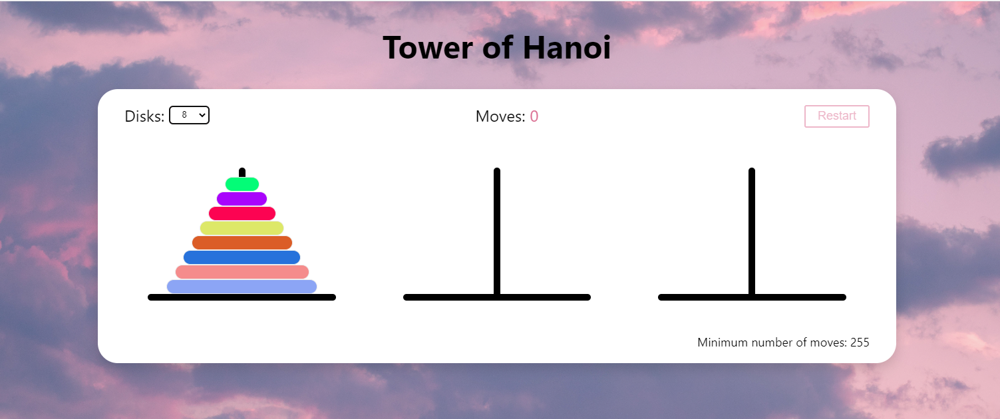

# Tower of Hanoi
This project is a [Tower of Hanoi](https://en.wikipedia.org/wiki/Tower_of_Hanoi) browser 
game built with [React](https://react.dev/), [TypeScript](https://www.typescriptlang.org/),
[Styled Components](https://styled-components.com/),
[React DnD](https://react-dnd.github.io/react-dnd/about).

## Game Objective
Hanoi Tower a mathematical game/puzzle consisting of three rods and a number of disks of different sizes, 
which can slide onto any rod. The puzzle starts with the disks in a neat stack in ascending order of size on one rod, 
the smallest at the top, thus making a conical shape.

The objective of the puzzle is to move the stack to another tower following these simple rules:

* Only one disk can be moved at a time.
* Each move consists of taking the upper disk from one of the stacks and placing it on top of another stack or on an empty tower.
* No larger disk may be placed on top of a smaller disk.

## Implementation features

Implemented in the game:
* the ability to move the disk from a tower to another tower, the dragging-and-dropping functionality
  is powered by the [React DnD](https://react-dnd.github.io/react-dnd/about),
* the ability to select the number of disks of the tower, which affects the complexity of the game,
* stroke counter,
* counting and displaying the minimum number of iterations to move the stack with a given number of disks,
* the ability to restart the game.

The project integrate with [Styled Components](https://styled-components.com/) to handle React component styling.
React useReducer hook helps to manage tha application state.

